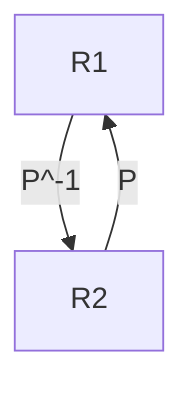

# Change of basis

[Mathematically](https://fr.wikipedia.org/wiki/Changement_de_base_(alg%C3%A8bre_lin%C3%A9aire)):

$$X=P_{B\rightarrow B'} . X'$$

or speaking with $V$ and $R1$, $R2$:

$$V_{R1}=P_{R1\rightarrow R2} . V_{R2}$$

Meaning that if we have the coordinates of a vector $V$ expressed in base $R2$, we can get its coordinates expressed in base $R1$ by multiplying this vector by the transformation matrix from $R1$ to $R2$: $P_{R1\rightarrow R2}$

$P_{R1\rightarrow R2}$ is a matrix, whose columns are $R2$ vectors, expressed into $R1$

And reciprocally (from $R1$ to $R2$):

$$V_{R2}=(P_{R1\rightarrow R2})^{-1} . V_{R1}$$

---

To summup:

ie, to express a vector:
- from $R1$ to $R2$, we multiply it by $P^{-1}$
- from $R2$ to $R1$, we multiply it by $P$
