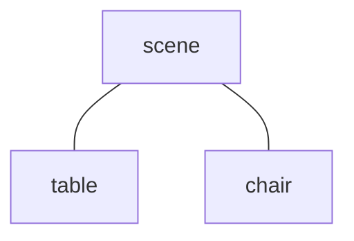
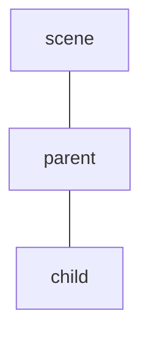
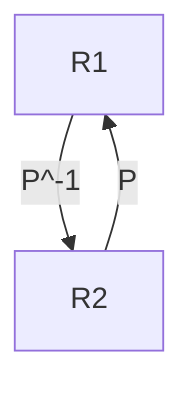
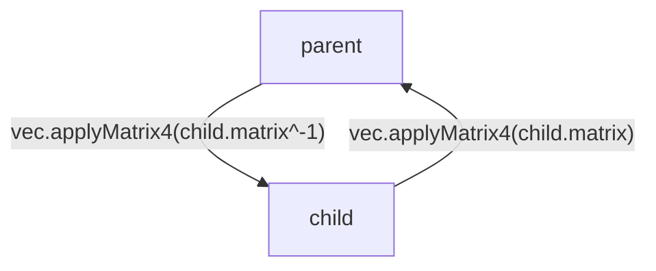
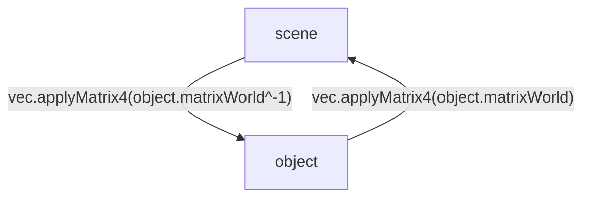
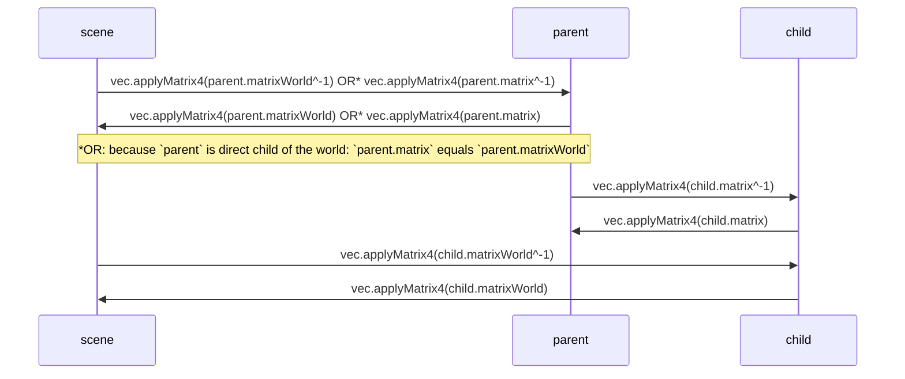
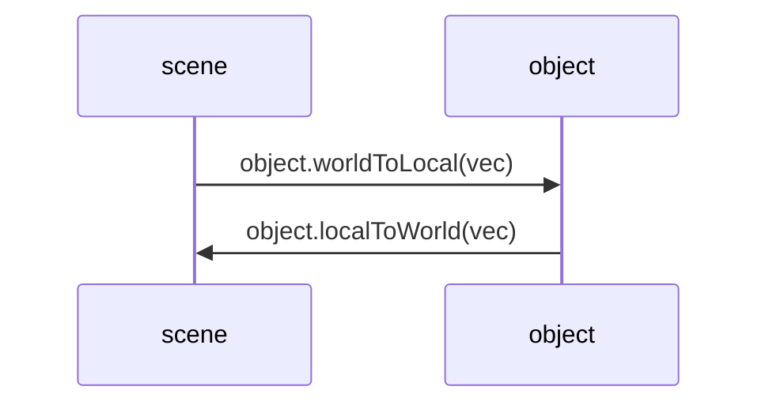
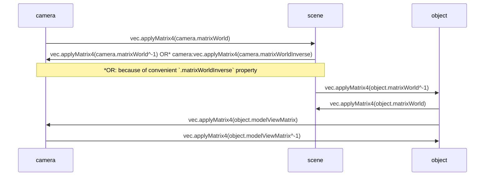
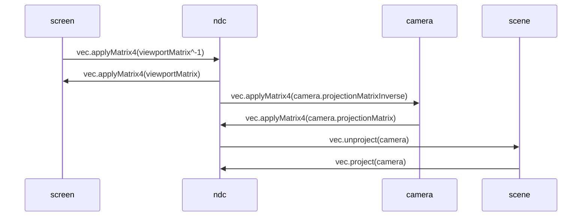
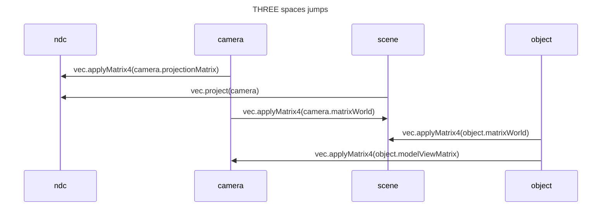

THREE spaces
===

## "Space"

In a 3d environment, a "space" is defined by 3 perpendicular axes and an origin:
[](https://docs.google.com/drawings/d/1thD_hICjAhERuMXal7ez8HhEk9JPYV7iF5Mhb2VIYCU/edit)

It allows us to locate any "point" in this space, by its 3 coordinates components:
[](https://docs.google.com/drawings/d/1kflQFDXOeOiT6VvMu_0fktmethV-jprDh9zLv8ZBshE/edit)

**In THREE, a such space is called an [`Object3D`](https://threejs.org/docs/index.html?q=object#api/en/core/Object3D).**

## World space

A default "world" space will always exist in a [`Scene`](https://threejs.org/docs/index.html?q=scene#api/en/scenes/Scene):
[](https://docs.google.com/drawings/d/1S81NPv6S1NSpr2A_qBdVaZaKk4l4LqN3I_6jQa0tJ_E/edit)
```js
const scene = new THREE.Scene()
```

Any other "object" in the scene has also its own "space", typically a [`Mesh`](https://threejs.org/docs/index.html?q=mesh#api/en/objects/Mesh) — which is an `Object3d`:
[](https://docs.google.com/drawings/d/10be51vBd848bzi2RwGcrRLCmRWqmhSwPFs8FR5kdKvQ/edit)
```js
const cube = new THREE.Mesh( /* ... */ )
scene.add(cube)
```

NB: A [`Camera`](https://threejs.org/docs/index.html?q=camera#api/en/cameras/Camera) is also an `Object3D` and has its own "space" too.

## Topology

`Scene` is the root of any "object":


Objects can be nested together, thanks to [`Object3D.add()`](https://threejs.org/docs/index.html?q=matrix4#api/en/core/Object3D.add) method:



This shapes a tree/hierarchy of spaces.

## Transforms

We can `position`, `rotate`, `scale` a such "space". An [`Object3D.matrix`](https://threejs.org/docs/index.html?q=matrix4#api/en/core/Object3D.matrix) property exists that holds all those transforms applied.

## Change of basis

Sometimes, we know the coordinates of a point in a given "space", but we want to express them in another "space"... That is what we call a [change of basis](https://en.wikipedia.org/wiki/Change_of_basis).

We represent this point by a `vec`.

### Math

[Mathematically](https://fr.wikipedia.org/wiki/Changement_de_base_(alg%C3%A8bre_lin%C3%A9aire)):

$$X=P_{B\rightarrow B'} . X'$$

or speaking with $V$ and $R1$, $R2$:

$$V_{R1}=P_{R1\rightarrow R2} . V_{R2}$$

Meaning that if we have the coordinates of a vector $V$ expressed in base $R2$, we can get its coordinates expressed in base $R1$ by multiplying this vector by the transformation matrix from $R1$ to $R2$: $P_{R1\rightarrow R2}$

And reciprocally (from $R1$ to $R2$):

$$V_{R2}=(P_{R1\rightarrow R2})^{-1} . V_{R1}$$

---

To summup:



ie, to express a vector:
- from $R1$ to $R2$, we multiply it by $P^{-1}$
- from $R2$ to $R1$, we multiply it by $P$

### A. Direct child/parent "spaces"

To know the coordinates of `vec` in the other "direct" space:



### B. Any "world" descendant object

In each "space", a convenient `Object3D.matrixWorld` accumulates the transforms of all its ancestors, up to the `Scene` root.

It helps going from world <-> local space more easily (rather than recomputing the chain-matrices product ourselves):



NB: `object` could be at any level in the hierarchy

### General case (A. and B.)



NB: 2 other sugar methods `Object3D.worldToLocal` and `Object3D.localToWorld` exist to jump from/to an object local/world space.



NB: It is equivalent to apply object's `.matrixWorld`/`.matrixWorld^-1`

## Camera - `Object3D.modelViewMatrix` shortcut

As already said, `Camera` is a regular `Object3d`: so it has a `.matrix` and a `.matrixWorld` property.

Plus conveniently, `Camera` also provides a pre-computed `.matrixWorldInverse` property (which is the same as `.matrixWorld.invert()` if we wanted to compute it manually)

---

That said, and according to the [`Matrix4` doc](https://threejs.org/docs/#api/en/math/Matrix4):
> An object's `modelViewMatrix` is the object's `matrixWorld` pre-multiplied by the camera's `matrixWorldInverse`.

Ie: `Object3D.modelViewMatrix = camera.matrixWorldInverse x Object3D.matrixWorld`

In other words, there exists a `Object3D.modelViewMatrix` property to create a shortcut to jump directly from object's local coordinates to camera coordinates by: `vec.applyMatrix4(object.modelViewMatrix)`



## Screen

- [`Camera.projectionMatrix`](https://threejs.org/docs/index.html?q=matri#api/en/cameras/Camera.projectionMatrix) -- Camera space to NDC space
- `viewportMatrix` -- NDC space to screen space
- [`Vector3.project`](https://threejs.org/docs/index.html?q=vector#api/en/math/Vector3.project) ([source](https://github.com/mrdoob/three.js/blob/2a8a3faef5d2f8961026a23e1002d3f7d7ee5b87/src/math/Vector3.js#L315-L319)) -- world space to NDC space



with:

```js
  const viewportMatrix = new THREE.Matrix4();
  const { x: WW, y: WH } = renderer.getSize(new THREE.Vector2()); // canvas size (dpr-independent)
  viewportMatrix.set(
    WW / 2, 0, 0, WW / 2,
    0, -WH / 2, 0, WH / 2,
    0, 0, 0.5, 0.5,
    0, 0, 0, 1
  );
  ```

## Summary



## _

<details>
  <!--
  Following is for https://abernier.github.io/abernier website
  -->
  
  <script type="module">
  import mermaid from 'https://unpkg.com/mermaid@9.2.2/dist/mermaid.esm.min.mjs';
  mermaid.init(undefined, '.language-mermaid');
  </script>
</details>


